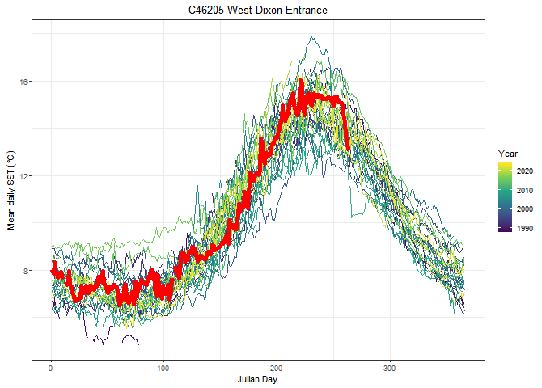
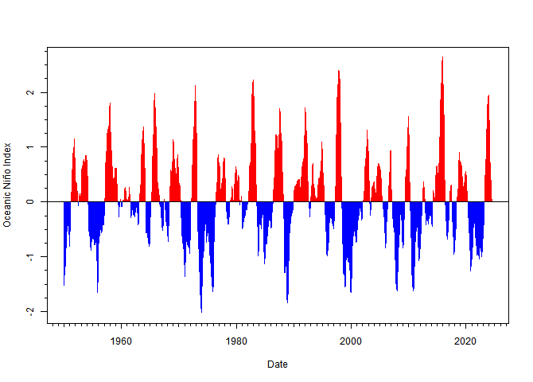
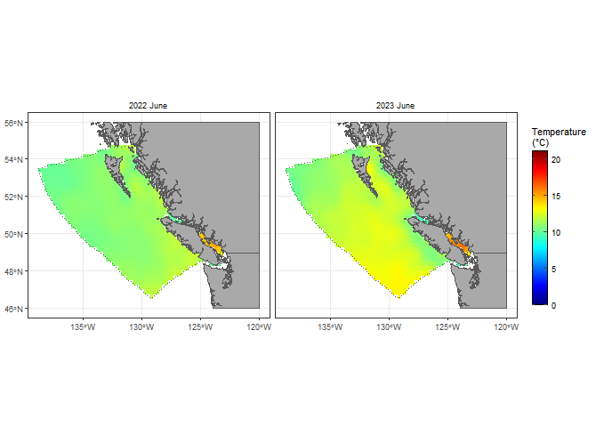

<!-- README.md is generated from README.Rmd. Please edit that file -->
<!-- build_readme() will build this when developing, but installs pacea from -->
<!-- scratch (and it might not be the local version) so it's much quicker to do -->
<!-- rmarkdown::render("README.Rmd"), which also builds an .html that can be -->
<!-- viewed locally (and isn't pushed to GitHub)  -->

<!-- Figures - to update a figure, manually run the piece of code that makes -->
<!-- the .png file. See notes below (and Issue #44). -->

```{r, include = FALSE}
knitr::opts_chunk$set(
  collapse = TRUE,
  comment = "#>",
#  cache=TRUE,  # want to try this
  fig.path = "man/figures/README-",
  out.width = "60%"
  )
# library(ggplot2)    # TODO needed for harbour_seals plot - look into
library(tibble)
```

# pacea 

<!-- badges: start -->
[](https://github.com/pbs-assess/pacea/actions/workflows/R-CMD-check.yaml)
[](https://app.codecov.io/gh/pbs-assess/pacea?branch=main)

<!-- badges: end -->

An R package of Pacific ecosystem information to help facilitate an ecosystem
approach to fisheries management.

*We wrangle the data so you don't have to*

pacea stands for PACific Ecosystem Approach.

pacea is a R package containing a variety of data
sets and model output. We wrangle the data sets behind the scenes to get them into usable formats
in R, and provide helpful plotting functions. All data sets include
documentation regarding the original sources and authors, who should be cited
and consulted as appropriate.

## What is in pacea?

Currently, pacea contains:

 - `r format(nrow(buoy_sst), big.mark = ",")` calculations of daily sea surface
   temperature based on data from `r nrow(buoy_metadata)` buoys.

 - outputs from the spatial British Columbia continental margin (BCCM) model, the coupled
   physical-biogeochemical model by Peña et al. (2019). Variables are for 40,580 spatial cells across Canada's Pacific
     Exclusive Economic Zone, and are given as 27 years of monthly means (from
   1993 to 2019). The variables are:
   - dissolved oxygen concentration
   - pH
   - salinity
   - temperature
   - depth-integrated phytoplankton
   - depth-integrated primary production.

   For applicable variables these are given for
   - sea surface
   - 0-40 m integration
   - 40-100 m integration
   - 100 m to the sea bottom
   - sea bottom.

- NOAA's spatial Optimum Interpolation Sea Surface Temperature (OISST) record, that incorporates observations from different platforms (satellites,
     ships, buoys, and Argo floats):
   - provided as weekly and monthly means from `r paste(lubridate::month(min(oisst_month$start_date), label = TRUE),
     lubridate::year(min(oisst_month$start_date)))` to `r paste(lubridate::month(max(oisst_month$start_date), label = TRUE),
     lubridate::year(max(oisst_month$start_date)))`.

- 9 climatic and oceanographic indices, such as the Pacific Decadal Oscillation
   and those related to El Niño.

- estimates of abundances for Harbour Seals and Pacific Hake (with Pacific
  Herring coming soon).

Plotting and helper functions are provided, and demonstrated in the detailed vignettes. All
data and model outputs are fully documented and referenced.

Peña, M.A., Fine, I. and Callendar, W. (2019). Interannual variability in
primary production and shelf-offshore transport of nutrients along the northeast
Pacific Ocean margin. Deep-Sea Research II, doi:10.1016/j.dsr2.2019.104637.
https://www.sciencedirect.com/science/article/pii/S0967064519300220


## Brief examples of some questions that can be quickly investigated

**How does this year's sea surface temperature (red curve) in North Hecate Strait compare to previous
years, based on the buoy there?**
<!-- Run this png code manually (as not evaluated here) to update the figure -->
```{r northhecatetempmakefig, eval = FALSE, echo = FALSE}
png(paste0(here::here(), "/man/figures/README-north-hecate-temp.png"),
    width = 670,   # 670 matches size from running from a chunk
    height = 480)
plot(buoy_sst,
     stn_id = "C46183")
dev.off()
```

```{r northhecatetemp, eval = FALSE}
plot(buoy_sst,
     stn_id = "C46183")
```

{width=80%}

**Are we entering a phase of El Niño, based on the Oceanic Niño Index? (If the
last bars are red, then 'yes')**

```{r onimakefig, eval = FALSE, echo = FALSE}
png(paste0(here::here(), "/man/figures/README-oni.png"),
    width = 670,   # 670 matches size from running from a chunk
    height = 480)
plot(oni)
dev.off()
```

```{r oni, eval = FALSE}
plot(oni)
```

{width=80%}

**How has the status of the Pacific Decadal Oscillation changed over time?**
```{r pdomakefig, eval = FALSE, echo = FALSE}
png(paste0(here::here(), "/man/figures/README-pdo.png"),
    width = 670,   # 670 matches size from running from a chunk
    height = 480)
plot(pdo)
dev.off()
```

```{r pdo, eval = FALSE}
plot(pdo)
```

{width=80%}

**What were the differences in spatial pattern of sea surface temperature between June 2022 and 2023 (using OISST data)?**
```{r oisstmakefig, eval = FALSE, echo = FALSE}
png(paste0(here::here(), "/man/figures/README-oisst.png"),
    width = 670,   # 670 matches size from running from a chunk
    height = 480)
plot(oisst_month,
     months.plot = "June",
     years.plot = c(2022, 2023))
dev.off()
```

```{r oisst, eval = FALSE}
plot(oisst_month,
     months.plot = "June",
     years.plot = c(2022, 2023))
```

{width=80%}

**How did the upper 40m of dissolved oxygen differ between January and June, in 2015 (using BCCM ROMS output)?**
```{r bccmmakefig, eval = FALSE, echo = FALSE}
png(paste0(here::here(), "/man/figures/README-bccm.png"),
    width = 670,   # 670 matches size from running from a chunk
    height = 480)
plot(bccm_avg0to40m_oxygen(force = TRUE),
     months.plot = c(1, 6),
     years.plot = 2015)
dev.off()
```

```{r bccm, eval = FALSE}
plot(bccm_avg0to40m_oxygen(force = TRUE),
     months.plot = c(1, 6),
     years.plot = 2015)
```

{width=80%}

**What is the estimated abundance of Pacific Harbour Seals for each of seven regions?**
```{r harboursealsmakefig, eval = FALSE, echo = FALSE}
png(paste0(here::here(), "/man/figures/README-harbour-seals.png"),
    width = 670,   # 670 matches size from running from a chunk
    height = 480)
plot(harbour_seals)
dev.off()
```

```{r sealplot, eval = FALSE}
plot(harbour_seals)
```

{width=80%}

You can view and analyse all these data sets in the usual way in R. For example:
```{r onivalues}
oni
```

## Vignettes

For more detailed explanations of the data sets and functionality see the
vignettes, which are already rendered here:

* [indices.html](http://htmlpreview.github.io/?https://github.com/pbs-assess/pacea/blob/main/vignettes/indices.html)
  Climatic and oceanographic indices and associated plotting functions.
* [buoys.html](http://htmlpreview.github.io/?https://github.com/pbs-assess/pacea/blob/main/vignettes/buoys.html)
  Calculated daily mean sea surface temperatures and associated plotting functions.
* [populations.html](http://htmlpreview.github.io/?https://github.com/pbs-assess/pacea/blob/main/vignettes/populations.html)
  Estimates of animal populations and associated plotting functions.
* [oisst.html](http://htmlpreview.github.io/?https://github.com/pbs-assess/pacea/blob/main/vignettes/oisst.html)
  OISST data and calculations and associated plotting functions.
* [bccm.html](http://htmlpreview.github.io/?https://github.com/pbs-assess/pacea/blob/main/vignettes/bccm.html)
  BCCM model results, calculations, and associated plotting functions.

The presentaion where we introduced `pacea` is available [here as
.pdf](talks/pacea-release-talk.pdf); the code to build it is [here as
.Rmd](talks/pacea-release-talk.Rmd).

## Installation

Okay, if you're convinced this package might be useful for you, then to install
the latest version just:

```
install.packages("remotes")    # If you do not already have the "remotes" package

remotes::install_github("pbs-assess/pacea")
```

If you get an error like
```
Error in utils::download.file(....)
```
then the connection may be timing out (happens to us on the DFO network). Try

```
options(timeout = 1200)
```
and then try and install again. If you get a different error then post an Issue
or contact <a href="mailto:andrew.edwards@dfo-mpo.gc.ca">Andy</a> or <a href="mailto:travis.tai@dfo-mpo.gc.ca">Travis</a> for help.

## Updates

We plan to continually enhance `pacea` by updating current data sets and adding
new ones, as well as adding functionality. To explain these, we will document them
by date in the [NEWS](NEWS.Md).

We plan to update the indices, buoy temperatures, and OISST values on the 20th of every month (or soon
after), which should capture updates to those data.

To check what date you installed `pacea` locally
on your machine, we have the helper command:

```{r installed, eval=FALSE}
pacea_installed()

You last locally installed pacea on 2023-11-01 which is 8 days ago.

Compare that with the updates in the NEWS file (and you can also check dates of the latest commits at
https://github.com/pbs-assess/pacea/commits/main)
```

The commits tell you when we last changed something, while the [NEWS](NEWS.md)
will give a more concise summary of changes by date. Then you may wish to update
`pacea` by running `remotes::install_github("pbs-assess/pacea")` again.

## Audience and motivation

The primary audience is stock assessment scientists who want to analyse
environmental variables in the context of their stock assessment (but we
anticipate other interested users). The Fisheries Act requires management of fisheries to take into account "[the biology of the fish and the environmental conditions affecting the stock](https://laws-lois.justice.gc.ca/eng/acts/f-14/page-3.html#h-1175547)". Such an Ecosystem Approach to Fisheries Management requires data.

A comprehensive [2022 analysis of Canadian stock assessments](https://publications.gc.ca/collections/collection_2022/mpo-dfo/Fs97-6-3473-eng.pdf) found that availability of data on environmental variables was the leading cause of not integrating such information into assessments. pacea aims to help make data availability more streamlined, and avoid each individual assessment scientist having to figure out themselves where to get appropriate data.

This work is strongly motivated by, and based on, the [GSLea](https://github.com/duplisea/gslea) R package by Dan Duplisea and colleagues for the Gulf of St Lawrence.

## Acknowledgments

This work is funded by a Competitive Science Research Fund grant from Fisheries
and Oceans Canada (project 21-FS-03-13).

We thank the following for contributing ideas, example code for ROMS output, model output,
and/or helping with ideas and coding issues:

- Kelsey Flynn, Jessica Nephin, Lindsay Davidson, Strahan Tucker,
  Brianna Wright, Patrick Thompson, Matt Grinnell, Sean Anderson, Philina
  English, Chris Grandin, Jennifer Boldt, and others.

And a big thanks to Carley Colclough for expertly designing the pacea logo.

## Notes for developers

Edit and render the README.Rmd file, not the README.Md file. If you add any new
figures then commit and push them (they will be in
man/figures/README-<chunk-name>) so they show up on the GitHub README. Always
render the .Rmd so that it and the rendered .Md stay in sync (see
https://github.com/pbs-assess/pacea/issues/44#issuecomment-1793235838 for how to
have Git check that README.Md is newer than README.Rmd).

Every data set is built using code in the `raw-data/` directory, with
documentation in `R/data.R`. Document everything!

If you add new functions please add tests as well so we retain good code
coverage (as indicated in the badge at the top of the README on GitHub).

Use the standard `lower_case_and_underscores` for naming
variables and functions.

Citation information is in inst/CITATION, so if you update DESCRIPTION file
(e.g. add an author) then update that also, and may want to change the info at the
start of this file.

Logo included by running `use_logo("inst/pacea-logo-from-carley.png")`. The .png was
expertly designed by Carley Colclough. There is also `inst/pacea-logo-for-printing.jpg`
for printing purposes.

We will add details of how to work on your own branch before merging into the
main branch, such that the main version is always installable, and guidelines
for adding to the [NEWS](NEWS.Md).
