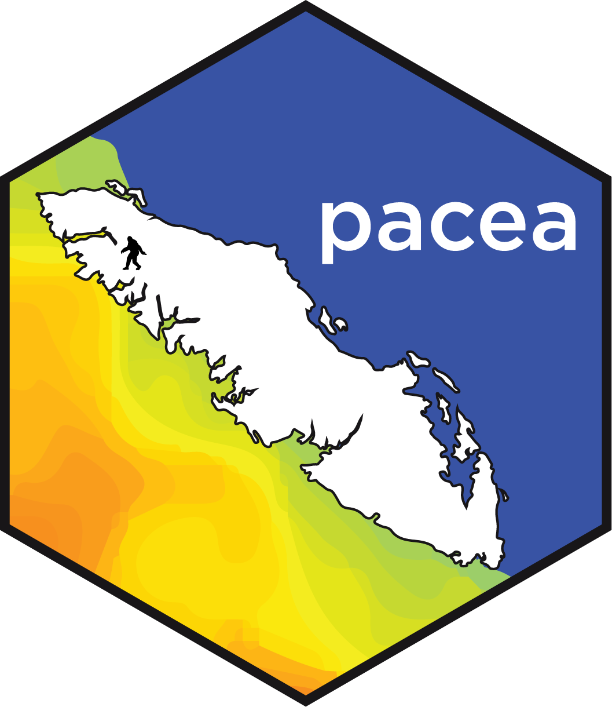
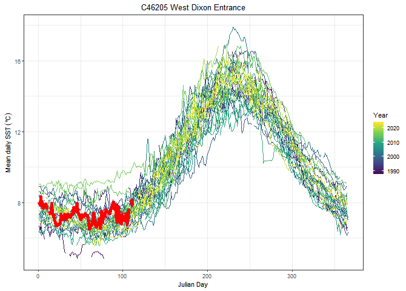
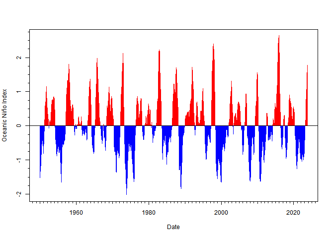
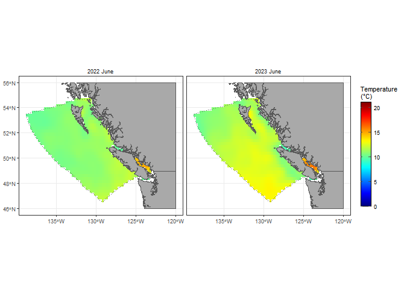
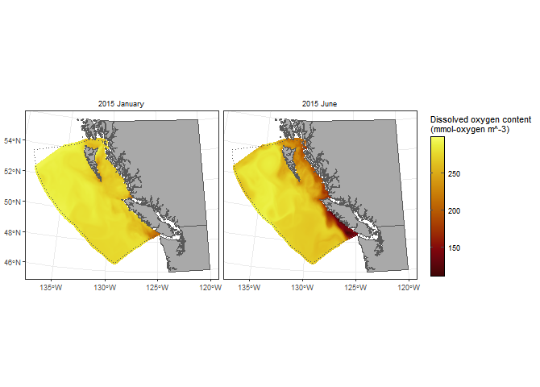
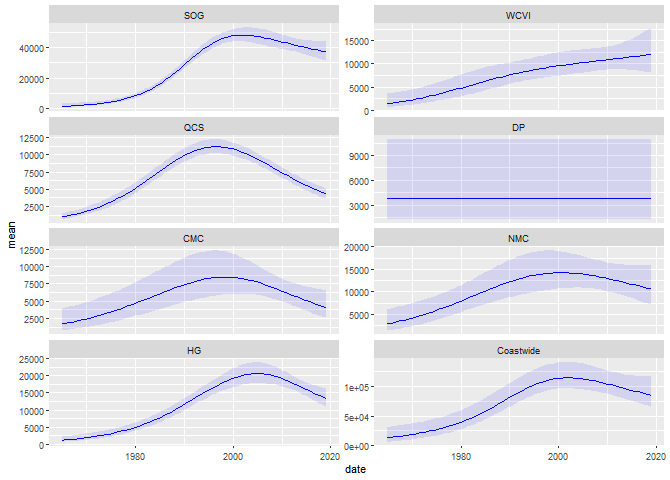
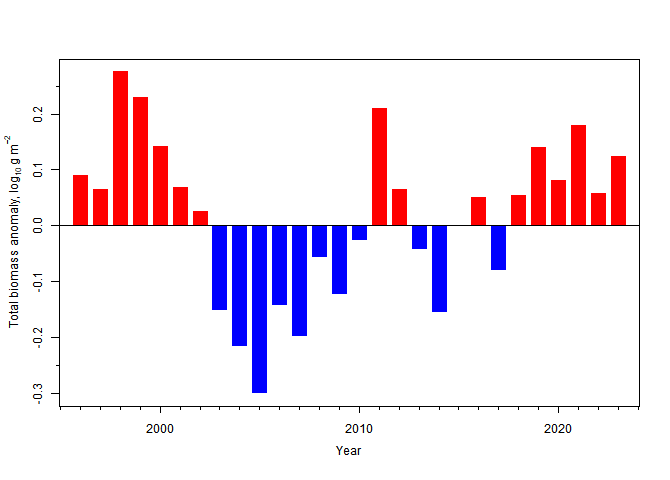

<!--
README.md is generated from README.Rmd. Please edit that file. Build with
-->
<!--
which builds the .html that can be viewed locally (but isn't pushed to GitHub;
GitHub uses README.md to make the page you see on GitHub).

Figures - to update a figure, manually run the piece of code that makes
the .png file. See notes below (and Issue #44).
-->

# pacea 

<!-- badges: start -->

[](https://github.com/pbs-assess/pacea/actions/workflows/R-CMD-check.yaml)
[](https://codecov.io/gh/pbs-assess/pacea)
[](https://zenodo.org/doi/10.5281/zenodo.13840804)

<!-- badges: end -->

An R package of Pacific ecosystem information to help facilitate an
ecosystem approach to fisheries management.

*We wrangle the data so you don’t have to*

pacea stands for PACific Ecosystem Approach, and is pronounced
‘pac-ee-a’, with pac as in Pacific.

pacea is a R package containing a variety of data sets and model output.
We wrangle the data sets behind the scenes to get them into usable
formats in R, and provide helpful plotting functions. All data sets
include documentation regarding the original sources and authors, who
should be cited and consulted as appropriate.

Please continue reading through this README file, and see the vignettes
to get you started.

## What is in pacea?

Currently, pacea contains:

-   206,901 calculations of daily sea surface temperature based on data
    from 19 buoys. **Updated monthly.**

-   outputs from the spatial British Columbia continental margin (BCCM)
    model, the coupled physical-biogeochemical model by Peña et
    al. (2019). Variables are for 40,580 spatial cells across Canada’s
    Pacific Exclusive Economic Zone, and are given as 27 years of
    monthly means (from 1993 to 2019). The variables are:

    -   dissolved oxygen concentration
    -   pH
    -   salinity
    -   temperature
    -   depth-integrated phytoplankton
    -   depth-integrated primary production.

    For applicable variables these are given for

    -   sea surface
    -   0-40 m integration
    -   40-100 m integration
    -   100 m to the sea bottom
    -   sea bottom.

-   NOAA’s spatial Optimum Interpolation Sea Surface Temperature (OISST)
    record, that incorporates observations from different platforms
    (satellites, ships, buoys, and Argo floats):

    -   provided as weekly and monthly means from Sep 1981 to Jul 2024.
        **Updated monthly.**

-   9 climatic and oceanographic indices, such as the Pacific Decadal
    Oscillation and those related to El Niño. **Updated monthly.**

-   estimates of abundances for Harbour Seals.

-   estimates of spawning stock biomass and annual recruitments for
    Pacific Hake and Pacific Herring. **Updated annually.**

-   zooplankton biomass anomalies in the Strait of Georgia, for 25
    species groups, from 1996 onwards. **Updated annually.**

Plotting and helper functions are provided, and demonstrated in the
detailed vignettes. All data and model outputs are fully documented and
referenced.

Peña, M.A., Fine, I. and Callendar, W. (2019). Interannual variability
in primary production and shelf-offshore transport of nutrients along
the northeast Pacific Ocean margin. Deep-Sea Research II,
<doi:10.1016/j.dsr2.2019.104637>.
<https://www.sciencedirect.com/science/article/pii/S0967064519300220>

## What’s new (since the original release)?

The values highlighed above with **Updated monthly** have been updated
each month since the release of pacea, as documented in the
[NEWS](NEWS.md), which it is advisable to check when you update your
pacea installation (see below). Since the initial release we have also
(in order):

-   updated the estimates of Pacific Hake abundance and recruitment with
    values from the 2024 assessment (retaining the original estimates
    from the 2023 assessments for reproducibility); see the
    [populations.html](http://htmlpreview.github.io/?https://github.com/pbs-assess/pacea/blob/main/vignettes/populations.html)
    vignette.

-   added zooplankton biomass anomalies for the Strait of Georgia, with
    a new vignette:
    [zooplankton.html](http://htmlpreview.github.io/?https://github.com/pbs-assess/pacea/blob/main/vignettes/zooplankton.html).

-   extended calculations of the Aleutian Low Pressure Index (ALPI) up
    to 2022; they were originally only available to 2015. The Aleutian
    Low was mentioned in several talks at the 2024 State of the Pacific
    Ocean meeting, motivating us to update the values here.

-   added helper function `a()`, shorthand for `as.data.frame()`, see
    examples in `?a`.

-   added Pacific Herring stock assessment results, for spawning stock
    biomass and age-2 recruitment for each of the five major stock
    assessment regions; see the
    [populations.html](http://htmlpreview.github.io/?https://github.com/pbs-assess/pacea/blob/main/vignettes/populations.html)
    vignette.

## Brief examples of some questions that can be quickly investigated

**How does this year’s sea surface temperature (red curve) in West Dixon
Entrance compare to previous years, based on the buoy there?**
<!-- Run this png code manually (as not evaluated here) to update the figure -->

``` r
plot(buoy_sst)    # Buoy C46205 is plotted by default
```



**Are we experiencing a phase of El Niño, based on the Oceanic Niño
Index? (If the last bars are red and above 0.5, then ‘yes’)**

``` r
plot(oni)
```



**How has the status of the Pacific Decadal Oscillation changed over
time?**

``` r
plot(pdo)
```


**What were the differences in spatial pattern of sea surface
temperature between June 2022 and 2023 (using OISST data)?**

``` r
plot(oisst_month,
     months.plot = "June",
     years.plot = c(2022, 2023))
```



**How did the upper 40m of dissolved oxygen differ between January and
June, in 2015 (using BCCM ROMS output)?**

``` r
plot(bccm_avg0to40m_oxygen(force = TRUE),
     months.plot = c(1, 6),
     years.plot = 2015)
```



**What is the estimated abundance of Pacific Harbour Seals for each of
seven regions?**

``` r
plot(harbour_seals)
```



**How has zooplankton biomass in the Strait of Georgia changed since
1996?**

``` r
plot(zooplankton_sog)
```



You can view and analyse all these data sets in the usual way in R. For
example:

``` r
oni
#> # A tibble: 895 × 4
#>     year month value anomaly
#>    <dbl> <dbl> <dbl>   <dbl>
#>  1  1950     1  24.7   -1.53
#>  2  1950     2  25.2   -1.34
#>  3  1950     3  25.8   -1.16
#>  4  1950     4  26.1   -1.18
#>  5  1950     5  26.3   -1.07
#>  6  1950     6  26.3   -0.85
#>  7  1950     7  26.2   -0.54
#>  8  1950     8  26.0   -0.42
#>  9  1950     9  25.8   -0.39
#> 10  1950    10  25.6   -0.44
#> # ℹ 885 more rows
```

**What climatic and oceanographic indices are currently available, and
over what years?**

``` r
knitr::kable(pacea_indices)
```

| Object      | Description                                     | Resolution | Start year | End year |
|:------------|:------------------------------------------------|:-----------|-----------:|---------:|
| pdo         | Pacific Decadal Oscillation                     | monthly    |       1854 |     2024 |
| npi_monthly | North Pacific Index (monthly)                   | monthly    |       1899 |     2024 |
| npi_annual  | North Pacific Index (annual)                    | annual     |       1899 |     2024 |
| alpi        | Aleutian Low Pressure Index                     | annual     |       1900 |     2022 |
| oni         | Oceanic Niño Index                              | monthly    |       1950 |     2024 |
| npgo        | North Pacific Gyre Oscillation                  | monthly    |       1950 |     2024 |
| ao          | Arctic Oscillation                              | monthly    |       1950 |     2024 |
| soi         | Southern Oscillation Index                      | monthly    |       1951 |     2024 |
| mei         | Multivariate El Niño Southern Oscillation Index | monthly    |       1979 |     2024 |

## Vignettes

For more detailed explanations of the data sets and functionality see
the vignettes, which are already rendered here (note that we do not
automatically update them when the data in pacea are updated, so if you
run them locally you may get more up-to-date values):

-   [indices.html](http://htmlpreview.github.io/?https://github.com/pbs-assess/pacea/blob/main/vignettes/indices.html)
    Climatic and oceanographic indices and associated plotting
    functions.
-   [buoys.html](http://htmlpreview.github.io/?https://github.com/pbs-assess/pacea/blob/main/vignettes/buoys.html)
    Calculated daily mean sea surface temperatures and associated
    plotting functions.
-   [populations.html](http://htmlpreview.github.io/?https://github.com/pbs-assess/pacea/blob/main/vignettes/populations.html)
    Estimates of animal populations and associated plotting functions.
-   [oisst.html](http://htmlpreview.github.io/?https://github.com/pbs-assess/pacea/blob/main/vignettes/oisst.html)
    OISST data and calculations and associated plotting functions.
-   [bccm.html](http://htmlpreview.github.io/?https://github.com/pbs-assess/pacea/blob/main/vignettes/bccm.html)
    BCCM model results, calculations, and associated plotting functions.
-   [zooplankton.html](http://htmlpreview.github.io/?https://github.com/pbs-assess/pacea/blob/main/vignettes/zooplankton.html)
    Zooplankton anomalies for the Strait of Georgia, calculations, and
    associated plotting functions.

The presentations where we introduced `pacea` are available as .pdf.
[Here is the DFO version (10th November
2023)](talks/pacea-release-talk-dfo.pdf) and [here is the UVic Ecostats
version (21st November 2023)](talks/pacea-release-talk-uvic.pdf). The
code to build them is [here as .Rmd](talks/pacea-release-talk.Rmd).

## Installation

Okay, if you’re convinced this package might be useful for you, then to
install the latest version just:

    install.packages("remotes")    # If you do not already have the "remotes" package

    remotes::install_github("pbs-assess/pacea")

If you get an error like

    Error in utils::download.file(....)

then the connection may be timing out (happens to us on the DFO
network). Try

    options(timeout = 1200)

and then try and install again. If you get a different error then post
an Issue or contact
<a href="mailto:andrew.edwards@dfo-mpo.gc.ca">Andy</a> or
<a href="mailto:travis.tai@dfo-mpo.gc.ca">Travis</a> for help.

## Updates

We plan to continually enhance `pacea` by updating current data sets and
adding new ones, as well as adding functionality. To explain these, we
will document them by date in the [NEWS](NEWS.md).

We plan to update the indices, buoy temperatures, and OISST values on
the 20th of every month (or soon after), which should capture updates to
those data.

To check what date you installed `pacea` locally on your machine, we
have the helper command:

``` r
pacea_installed()

You last locally installed pacea on 2023-11-01 which is 8 days ago.

Compare that with the updates in the NEWS file (and you can also check dates of the latest commits at
https://github.com/pbs-assess/pacea/commits/main)
```

The commits tell you when we last changed something, while the
[NEWS](NEWS.md) will give a more concise summary of changes by date.
Then you may wish to update `pacea` by running
`remotes::install_github("pbs-assess/pacea")` again.

## Audience and motivation

The primary audience is stock assessment scientists who want to analyse
environmental variables in the context of their stock assessment (but we
anticipate other interested users). The Fisheries Act requires
management of fisheries to take into account “[the biology of the fish
and the environmental conditions affecting the
stock](https://laws-lois.justice.gc.ca/eng/acts/f-14/page-3.html#h-1175547)”.
Such an Ecosystem Approach to Fisheries Management requires data.

A comprehensive [2022 analysis of Canadian stock
assessments](https://publications.gc.ca/collections/collection_2022/mpo-dfo/Fs97-6-3473-eng.pdf)
found that availability of data on environmental variables was the
leading cause of not integrating such information into assessments.
pacea aims to help make data availability more streamlined, and avoid
each individual assessment scientist having to figure out themselves
where to get appropriate data.

This work is strongly motivated by, and based on, the
[GSLea](https://github.com/duplisea/gslea) R package by Dan Duplisea and
colleagues for the Gulf of St Lawrence.

## Citation

If you use `pacea` in your work then please cite it as (NOTE this has
been updated since the original release):

Edwards A.M., Tai T.C., Watson J., Peña M.A., Hilborn A., Hannah C.G.,
Rooper C.N., and Flynn K.L. (2024). pacea: An R package of Pacific
ecosystem information to help facilitate an ecosystem approach to
fisheries management. <https://github.com/pbs-assess/pacea>,
<https://zenodo.org/doi/10.5281/zenodo.13840804>

You may wish to add the date you installed it (using
`pacea_installed()`). Use `citation("pacea")` to get a version for LaTeX
and R Markdown bibliographies. Although the DOI badge at the top of this
page ends in …805, the …804 DOI is preferable because that will not
change with any future updates to the GitHub tag. So …804 seems simpler
and more consistent to use (thanks!).

Also let us know of any applications. This will help us devote effort
into maintaining `pacea`.

## Acknowledgments

This work is funded by a Competitive Science Research Fund grant from
Fisheries and Oceans Canada (project 21-FS-03-13).

We thank the following for contributing ideas, example code for ROMS
output, model output, and/or helping with ideas and coding issues:

-   Jessica Nephin, Lindsay Davidson, Strahan Tucker, Brianna Wright,
    Patrick Thompson, Matt Grinnell, Sean Anderson, Philina English,
    Chris Grandin, Jennifer Boldt, Kelly Young, and others.

And a big thanks to Carley Colclough for expertly designing the pacea
logo.

## Notes for developers

1.  Please work on your own development branch to ensure that the main
    branch is never broken (so users can always download the package).
    See below for details on branching.

2.  Edit and render the README.Rmd file, not the README.Md file. If you
    add any new figures then commit and push them (they will be in
    man/figures/README-<chunk-name>) so they show up on the GitHub
    README. Always render the .Rmd so that it and the rendered .Md stay
    in sync (see
    <https://github.com/pbs-assess/pacea/issues/44#issuecomment-1793235838>
    for how to have Git check that README.Md is newer than README.Rmd).

3.  Every data set is built using code in the `raw-data/` directory,
    with documentation in `R/data.R`. Document everything!

4.  If you add new functions please add tests as well so we retain good
    code coverage (as indicated in the badge at the top of the README on
    GitHub).

5.  Use the standard `lower_case_and_underscores` for naming variables
    and functions.

6.  Citation information is in inst/CITATION, so if you update
    DESCRIPTION file (e.g. add an author) then update that also and
    update the citation info above.

7.  Logo included by running
    `use_logo("inst/pacea-logo-from-carley.png")`. The .png was expertly
    designed by Carley Colclough. There is also
    `inst/pacea-logo-for-printing.jpg` for printing purposes.

### Branching in Git

To ensure the main branch is never broken (and so users can always
download the package), when editing package code please work on your own
branch and then merge it in. If just updating the README then we can
stick with the main branch (because messing something up should not void
the package being installable).

Your own branch should be called `dev-yourname`, e.g. `dev-andy` and
`dev-travis`. If you don’t yet have a branch you need to:

-   create it locally (and ‘check it out’, i.e. move into it):
    `git checkout -b dev-yourname`
-   tell Git where to push to:
    `git push --set-upstream origin dev-yourname` (Git will tell you
    this command if you do a `git push` without having run it)
-   update GitHub Actions so that pushes of your branch get properly
    tested on GitHub. Just add your branch to **both** lists of branches
    at the top of:
    -   `.github/workflows/R-CMD-check.yaml`
    -   `.github/workflows/test-coverage.yaml`
-   Do that as your first commit and push to check everything’s working.

Once you have your branch set up then the workflow is:

1.  Make sure you are all caught up on the main branch:

-   `git checkout main`
-   `git fetch`
-   `git rebase`

2.  Switch to your development branch and merge the main branch into it

-   `git checkout dev-yourname`
-   `git merge main`
-   for magit users (probably just Andy), this is just `b b` and `m m`
    (it recommends arguments)

3.  Do some new commits in your branch and push them in the usual way.
    GitHub Actions will work on your branch.

So from a quick test, the `R-CMD-check` badge only refers to the main
branch, which is great as it should never show as failing because we
should only be breaking things on own branch. Always having the green
passing badge should inspire consumer confidence. On GitHub you can
select your branch and see the tickmark, which will tell you if the
build has failed (or if your changes have caused the code coverage to
decline), and you’ll probably get an automatic email also, just to drive
home the message. So the badges on the README on your branch still
relate to the main branch.

You can click on the codecov badge on GitHub, and then on the codecov
page you can select your branch. There are ways to check code coverage
locally, but Andy found these all take a long time (and it’s easier to
push and let GitHub check the coverage). See commit 6c872da for the
commands Andy tried (now deleting to keep this README file cleaner).

4.  When you are happy with your changes and ready to merge them into
    the main branch, you need to

-   add any changes that users should be aware of to the [NEWS](NEWS.Md)
    file.

No need to mention things that are only of interest to developers (like
the commiting of these instructions). We want the NEWS to be succinct
and quickly readable so that people look at it.

Then you need to double check that the main branch is up-to-date with
the version on GitHub (someone may have pushed some changes since you
last fetched), then merge any changes back into your branch. You could
just check on GitHub (if you’re the last person to have pushed to main
then you are probably fine), or do these:

-   `git checkout main`

-   `git fetch`

-   `git rebase`

-   `git checkout dev-yourname`

-   `git merge main`

If that does merge in some new commits then you should

-   `git push` to run the GitHub Actions checks again on GitHub. If the
    merge says something like you are all caught up, no merging is
    needed (i.e. no-one committed anything to the main branch
    recenetly), then no need for the `git push`, since this entire step
    will not have added any new code.

5.  Now you are ready to merge your changes into the main branch, so
    that people will get them when they install/update `pacea`:

-   `git checkout main`
-   `git merge dev-yourname`
-   `git push`

And you are done! If you want, we have some aliases (such as `git co`
for `git checkout` and `git p` for `git push` listed in this example
.gitconfig file:
<https://raw.githubusercontent.com/quantitative-biology/module-1-git/main/misc/.gitconfig>
from our e-book
<https://www.quantitative-biology.ca/git-and-github.html#save-our-template-.gitconfig-file>
You can put those into your `.gitconfig` file if you like.

This can help understanding on branches:
<https://www.atlassian.com/git/tutorials/using-branches/git-merge>
