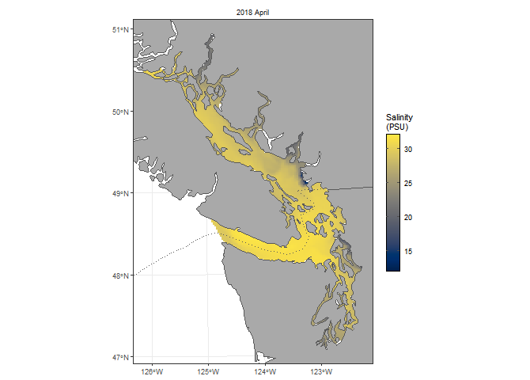

# HOTSSea

## Hindcast of the Salish Sea (HOTSSea)

- physical ocean model from 1980 to 2018 ([Oldford et al.,
  2025](https://doi.org/10.5194/gmd-2024-58))
- e.g. max surface salinity in April 2018:
```{r hotsseaplot, echo = FALSE, include = FALSE}
# plot(hotssea_avg30to150m_temperature_max())   # goes off bottom of screen
png(paste0(here::here(), "/talks/talks-manual-figures/hotssea-plot.png"),
    width = 670,   # 670 matches size from running from a chunk
    height = 480)
# plot(hotssea_avg30to150m_temperature_max())
plot(hotssea_surface_salinity_max())
dev.off()
```

```{r hotsseaplot2, eval = FALSE}
plot(hotssea_surface_salinity_max())
```

{width=60%}

```{r hotsseaplotforreport, eval = FALSE, echo = FALSE}
png(paste0(here::here(), "/talks/talks-manual-figures/hotssea-plot-for-sopo-25-report-2.png"),
    width = 670,   # 670 matches size from running from a chunk
    height = 480,  # 480 for 2x2
    res = 100)     # default is 72, actually increases font size, so tweak as desired
plot(hotssea_bottom_temperature_max(),
     months = c("January", "September"),
     years = 2010,
     eez = FALSE)
dev.off()

pdf(paste0(here::here(), "/talks/talks-manual-figures/hotssea-plot-for-sopo-25-report-2.pdf"),
    width = 2,
    height = 3)
plot(hotssea_bottom_temperature_max(),
     months = c("January", "September"),
     years = 2010,
     eez = FALSE)
dev.off()
```
