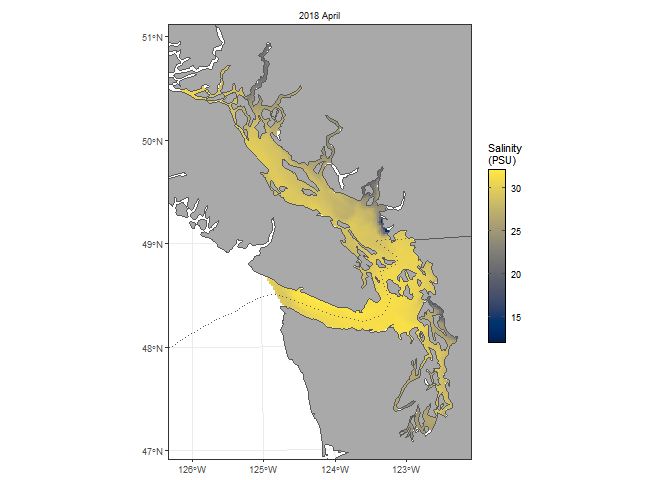

# HOTSSea

- Hindcast of the Salish Sea (HOTSSea)
- physical ocean model from 1980 to 2018 [Oldford et al., (*Geoscientific Model
Development*, in press)](https://doi.org/10.5194/gmd-2024-58).
- pacea includes temperature and salinty
- mapped to same 2 km x 2 km grid as `bccm_full` (slight overlap in domain)
- 6,165 spatial cells
- every month from January 1980 to December 2018
- various depth ranges
- monthly statistics (`min`, `mean`, `max`, `std`)
- saved in the same format as BCCM and OISST output (so same plotting
  etc. functions can be used)

## Available variables

HOTSSea objects in pacea are (40 in total):
```{r hotssea, eval = FALSE}
hotssea_data
                              data_name
1  hotssea_surface_salinity_min
2  hotssea_surface_salinity_mean
3  hotssea_surface_salinity_max
4  hotssea_surface_salinity_std
5  hotssea_surface_temperature_min
6  hotssea_surface_temperature_mean
7  hotssea_surface_temperature_max
8  hotssea_surface_temperature_std
9  hotssea_avg0to30m_salinity_min
10 hotssea_avg0to30m_salinity_mean
11 hotssea_avg0to30m_salinity_max
12 hotssea_avg0to30m_salinity_std
13 hotssea_avg0to30m_temperature_min
14 hotssea_avg0to30m_temperature_mean
15 hotssea_avg0to30m_temperature_max
16 hotssea_avg0to30m_temperature_std
17 hotssea_avg30to150m_salinity_min
18 hotssea_avg30to150m_salinity_mean
19 hotssea_avg30to150m_salinity_max
20 hotssea_avg30to150m_salinity_std
```


## Example plot

```{r hotsseaplot, echo = FALSE, include = FALSE}
# plot(hotssea_avg30to150m_temperature_max())   # goes off bottom of screen
png(paste0(here::here(), "/talks/talks-manual-figures/hotssea-plot.png"),
    width = 670,   # 670 matches size from running from a chunk
    height = 480)
# plot(hotssea_avg30to150m_temperature_max())
plot(hotssea_surface_salinity_max())
dev.off()
```

```{r hotsseaplot2, eval = FALSE}
plot(hotssea_surface_salinity_max())
```

{width=60%}

<!--
## File storage solutions

- original BCCM results saved in separate GitHub repo: `pacea-data`
- full BCCM and HOTSSea results are much larger, so saved on Zenodo
- get automatically downloaded and locally cached when users first need them

\
\footnotesize
Oldford, G.L., Jarníková, T., Christensen, V., and Dunphy, M. (in press).
HOTSSea v1: a NEMO-based physical Hindcast of the Salish Sea (1980–2018)
supporting ecosystem model
development. *Geoscientific Model
Development*. https://doi.org/10.5194/gmd-2024-58 .
\normalsize
-->
